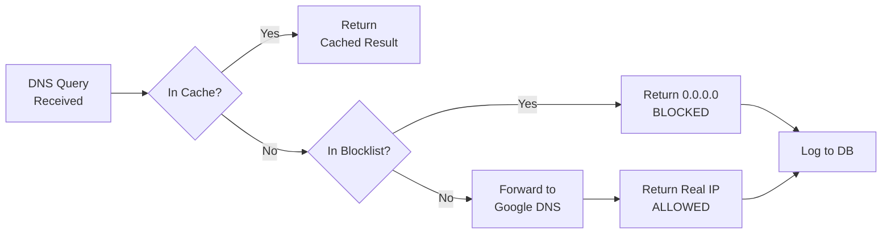
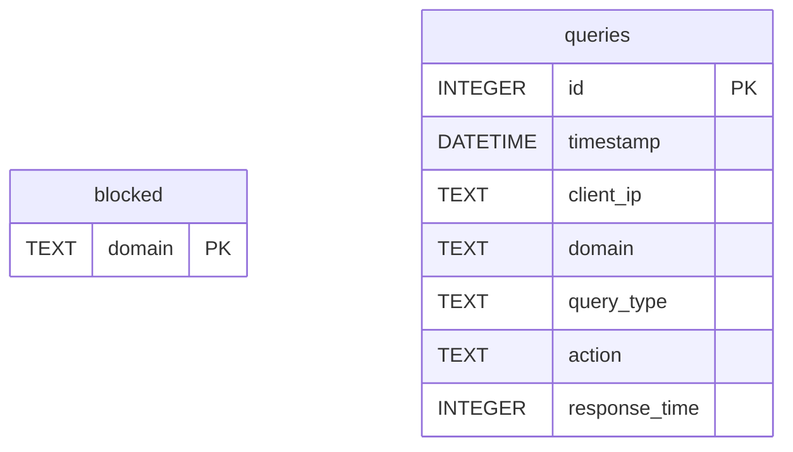
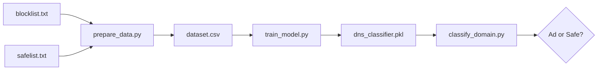

# 🛡️ DNS Filter

A local DNS proxy server that blocks ads and trackers at the network level, with a real-time web dashboard and optional machine learning classification.

---

## ✨ Features

| Feature | Description |
|---------|-------------|
| 🚫 DNS-Level Blocking | Intercepts DNS queries and blocks known ad/tracking domains |
| 📊 Real-Time Dashboard | Beautiful dark-themed web UI showing live statistics |
| 💾 SQLite Database | Stores blocklist and query logs efficiently |
| ⚡ FastAPI Backend | High-performance API serving dashboard data |
| 🧠 ML Classification | Optional model to detect suspicious domains |
| 🔄 LRU Caching | Instant responses for repeated queries |

---

## 🏗️ Architecture Overview

```mermaid
flowchart TB
    subgraph Client["🖥️ Client Device"]
        Browser["Browser/App"]
    end

    subgraph DNSFilter["🛡️ DNS Filter Server"]
        DNS["propt.py<br/>DNS Proxy"]
        Cache["LRU Cache"]
        DB[(dns_filter.db)]
    end

    subgraph Dashboard["📊 Dashboard"]
        API["api.py<br/>FastAPI"]
        UI["dashboard.html"]
    end

    subgraph External["🌐 External"]
        Google["Google DNS<br/>8.8.8.8"]
        Internet["Internet"]
    end

    Browser -->|DNS Query| DNS
    DNS --> Cache
    Cache -->|Cache Miss| DB
    DNS -->|Allowed| Google
    Google --> Internet
    DNS -->|Blocked| Browser
    DNS -->|Log| DB
    UI -->|fetch()| API
    API --> DB
```

---

## 🔄 DNS Query Flow



---

## 📁 Project Structure

| File/Folder | Purpose |
|-------------|---------|
| `propt.py` | Main DNS server - listens on port 53 |
| `api.py` | FastAPI backend serving dashboard APIs |
| `dashboard.html` | Web UI with dark theme |
| `blocklist.txt` | Raw list of ad/tracking domains |
| `database/dns_filter.db` | SQLite database |
| `list/clean_blocklist.py` | Populates DB from blocklist |
| `model/prepare_data.py` | Creates ML training dataset |
| `model/train_model.py` | Trains Random Forest classifier |
| `model/classify_domain.py` | Classifies new domains |
| `model/safelist.txt` | Known safe domains for training |

---

## 🚀 Installation

### Prerequisites

| Requirement | Version |
|-------------|---------|
| Python | 3.8+ |
| Privileges | Administrator (for port 53) |

### Setup Commands

```bash
# Navigate to project
cd "proj with db"

# Install dependencies
pip install dnslib fastapi uvicorn scikit-learn pandas

# Populate the blocklist database
cd list
python clean_blocklist.py ../blocklist.txt
cd ..
```

---

## 📖 Usage

### Step 1: Start Dashboard API
```bash
uvicorn api:app --reload
```
Open [http://localhost:8000](http://localhost:8000)

### Step 2: Start DNS Server (as Admin)
```bash
python propt.py
```

### Step 3: Configure DNS
Set your device DNS to `127.0.0.1`

---

## 🌐 API Endpoints

| Method | Endpoint | Returns |
|--------|----------|---------|
| GET | `/` | Dashboard HTML |
| GET | `/api/stats` | `{total_blocked_domains, blocked_queries, allowed_queries}` |
| GET | `/api/top-blocked` | Top 10 blocked domains with counts |
| GET | `/api/logs/blocked` | Recent blocked query logs |
| GET | `/api/logs/allowed` | Recent allowed query logs |
| GET | `/api/domains` | List of blocked domains |

---

## 🗄️ Database Schema



| Table | Purpose |
|-------|---------|
| `blocked` | Stores domains to block |
| `queries` | Logs all DNS queries |

---

## 🧠 Machine Learning Pipeline



### Features Extracted

| Feature | Description |
|---------|-------------|
| `length` | Domain string length |
| `num_digits` | Count of digits |
| `entropy` | Randomness score (Shannon entropy) |
| `num_dots` | Number of subdomains |
| `has_keyword` | Contains 'ad', 'track', etc. |
| `vowel_ratio` | Vowels vs consonants |

---

## 📊 Dashboard Tabs

| Tab | Content |
|-----|---------|
| Blocked Queries | Recent blocked DNS requests |
| Allowed Queries | Recent allowed DNS requests |
| All Blocked Domains | Full blocklist view |

---

## 🔧 Configuration

| Variable | Location | Default |
|----------|----------|---------|
| `DNS_PORT` | propt.py | 53 |
| `UPSTREAM_DNS` | propt.py | 8.8.8.8 |
| `SINKHOLE_IP` | propt.py | 0.0.0.0 |
| `DB_PATH` | api.py | database/dns_filter.db |

---

## 📜 License

MIT License - Feel free to modify and distribute.
